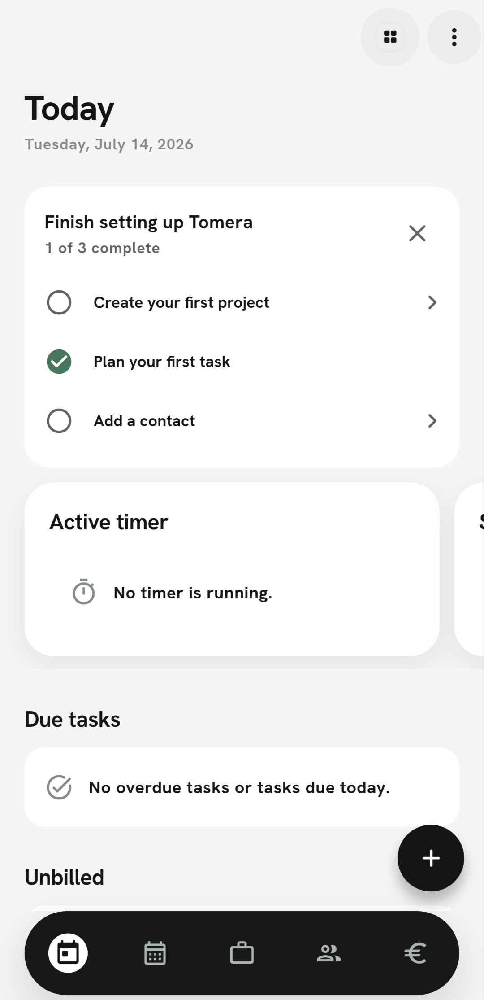
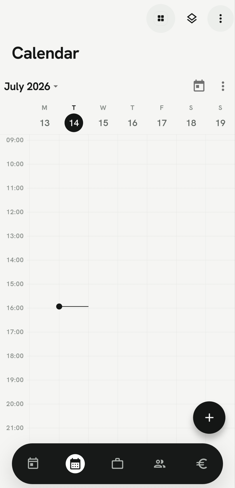
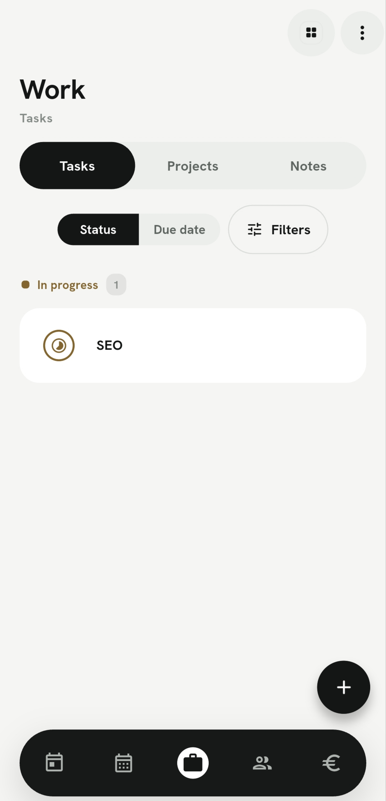
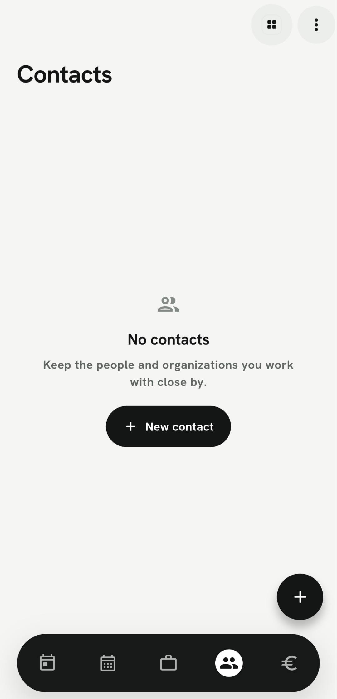
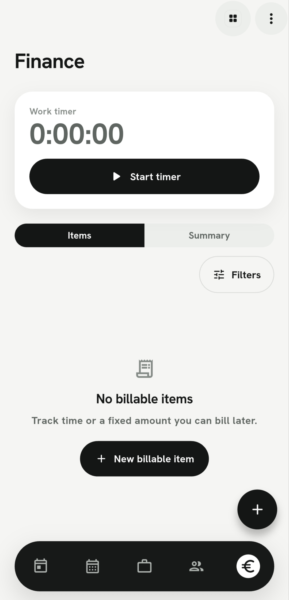

# Tomera

**A focused, local-first workspace for planning work, managing clients, and tracking billable time.**

Tomera brings calendars, tasks, notes, contacts, projects, and finances into one thoughtfully designed Flutter app. Work can be separated into color-coded workspaces while still remaining easy to view as a whole.

> [!NOTE]
> Tomera is currently under active development. Data is stored locally on the device; cloud synchronization is planned for a future release.

## Preview

<p align="center">
  
  &nbsp;
  
  &nbsp;
  
  &nbsp;
  
  &nbsp;
  
</p>

## Highlights

- **Unified calendar** — plan events and task deadlines in day, week, month, or schedule views, with drag-and-drop rescheduling and conflict warnings.
- **Flexible task management** — organize work by status or due date, set priorities, and surface overdue items quickly.
- **Projects and workspaces** — keep different areas of work separate with customizable names, colors, and enabled modules.
- **Markdown notes** — write, preview, search, and connect notes to other records.
- **Contact management** — keep client details and related work together, with convenient contact actions.
- **Time and billing** — run a persistent work timer, create billable items, track invoice status, review summaries, and export CSV data.
- **Reminders** — schedule local notifications for events and tasks.
- **Personalized appearance** — use light, dark, or system themes and configure time-rounding preferences.

## Built with

Tomera uses a modern Flutter architecture designed for maintainability and future synchronization:

- [Flutter](https://flutter.dev/) and Dart
- [Riverpod](https://riverpod.dev/) for state management and dependency injection
- [Drift](https://drift.simonbinder.eu/) for the local SQLite database
- [go_router](https://pub.dev/packages/go_router) for navigation
- [Syncfusion Flutter Calendar](https://pub.dev/packages/syncfusion_flutter_calendar) for calendar views
- Material 3, with custom Bricolage Grotesque and Hanken Grotesk typography

## Getting started

### Prerequisites

- A current [Flutter SDK](https://docs.flutter.dev/get-started/install) compatible with Dart `3.9` or newer
- Android Studio and an Android emulator, or a connected Android device

Check that your development environment is ready:

```bash
flutter doctor
```

### Run the app

```bash
git clone https://github.com/jamzu98/Tomera-app.git
cd Tomera-app
flutter pub get
flutter run
```

Tomera creates its local database automatically on first launch.

## Development

Run static analysis and the automated test suite before submitting changes:

```bash
flutter analyze
flutter test
```

Some source files are generated by Drift and Riverpod. After changing database definitions, DAOs, or annotated providers, regenerate them with:

```bash
dart run build_runner build --delete-conflicting-outputs
```

## Project structure

```text
lib/
├── core/       # Theme, routing, shared widgets, and notifications
├── data/       # Drift database, DAOs, and repositories
├── features/   # Calendar, tasks, notes, contacts, finance, and more
├── l10n/       # Localization resources
└── sync/       # Reserved for the planned synchronization layer
```

## Roadmap

- Cloud authentication and multi-device synchronization
- Continued platform refinement and broader release support
- Additional localization coverage

## Contributing

Issues and pull requests are welcome. For substantial changes, please open an issue first to discuss the proposed direction and keep contributions aligned with the project roadmap.

---

<p align="center">Built with Flutter.</p>
